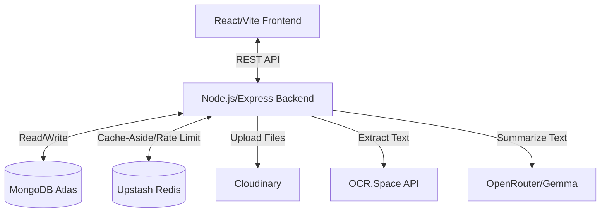

# MediTrack — Family Health Record Manager

MediTrack is a full-stack, secure platform designed to centralize and manage your family's medical records. It allows you to organize prescriptions, medical reports, vaccination schedules, medicine reminders, and health timelines in one easily accessible hub. 

## The Problem

Managing family medical records is often chaotic. Prescriptions get lost, vaccine records are scattered across different doctors, medicine schedules are forgotten, and important health history is buried in filing cabinets. Families waste time searching for critical information during emergencies.

## The Solution

MediTrack centralizes all family medical information in one secure digital hub. Keep prescriptions, reports, vaccine records, and health history organized and accessible whenever needed.

## Key Features

- **Family Management** - Create and manage distinct profiles for each family member.
- **Medical Records** - Store and organize prescriptions and medical reports in one place.
- **Medicine Reminders** - Set up alerts and track medication schedules.
- **Doctor Appointments** - Log and track upcoming doctor appointments.
- **Vaccinations** - Track immunization records for the entire family.
- **Emergency Contacts** - Quick access to trusted doctors and preferred hospitals.
- **Health Timeline** - A visual chronological history of medical events.
- **OCR Text Extraction** - Extract medical text from uploaded documents automatically.
- **AI Summary** - Generate insightful patient summaries from extracted report text.
- **High-Performance Caching** - Redis-backed caching for dashboards and family profiles, along with API rate limiting.

## Tech Stack

### Frontend
- **React.js** - UI framework
- **JavaScript** - Core language
- **Vite** - Build tool and development server
- **Tailwind CSS** - Utility-first styling

### Backend
- **Node.js + Express.js** - Server framework
- **JWT** - Authentication & authorization

### Database & Storage
- **MongoDB / MongoDB Atlas** - Primary NoSQL database for structured health records
- **Cloudinary** - Cloud storage for uploaded medical images and files

### AI & OCR
- **OCR.Space API** - Optical Character Recognition for document text extraction
- **OpenRouter API (Gemma Model)** - AI model for extracting medical info and generating patient summaries

### Caching
- **Upstash Redis** - Fast data caching and rate limiting

### Development & Tools
- **Git / GitHub** - Version control
- **Postman** - API testing (optional)

## System Architecture



## Redis Integration

Redis (via Upstash) is integrated into the backend as a high-performance caching layer to reduce MongoDB load and speed up data retrieval.

**Cache Flow (Cache-Aside Pattern):**
1. Read requests first check Redis. 
2. On a cache hit, data is returned instantly. 
3. On a cache miss, data is fetched from MongoDB, stored in Redis with a Time-To-Live (TTL), and then returned.
4. Write operations (creates, updates, deletes) explicitly invalidate the relevant cache keys to ensure data freshness.

**Implemented Use Cases:**
- **Timeline Caching:** Caches the merged health timeline (`dashboard:timeline:<userId>`) with explicit invalidation when reports, appointments, reminders, or vaccinations are modified.
- **Family Profiles:** Caches the full family member list (`family:members:<userId>`) and individual member profiles (`family:member:<memberId>`).
- **User Profile:** Caches the authenticated user profile (`profile:<userId>`).
- **Rate Limiting:** Protects expensive external AI/OCR endpoints (e.g., `POST /api/reports`) with fixed-window rate limit counters to prevent abuse.
- **Graceful Degradation:** If Redis is unavailable, the system automatically falls back to direct MongoDB reads and skips rate limiting without breaking the app.

## OCR + AI Workflow

The application automates the extraction and summarization of medical records through an asynchronous fire-and-forget pipeline:
1. **Document Upload:** User uploads a report. The backend saves it as "pending" in MongoDB and uploads the file to **Cloudinary**.
2. **Text Extraction (OCR):** The Cloudinary URL is sent to **OCR.Space**, which extracts the raw text from the document. The status updates to "ocr_processing", and then the extracted text is saved.
3. **AI Processing:** The extracted text is sent to **OpenRouter (Google Gemma)** to extract structured medical information (like diagnosis, doctor notes).
4. **AI Summary:** The model generates a concise patient-friendly summary of the medical report.
5. **Completion:** The final parsed data and summary are saved back to MongoDB, marking the report as "completed".

## Getting Started

### 1. Clone Repository
```bash
git clone <repository-url>
cd MediTrack
```

### 2. Install Dependencies
```bash
npm run install-all
```
*(This installs root, client, and server dependencies)*

### 3. Environment Variables
Create a `.env` file in the `server` directory using the provided example:
```bash
cp server/.env.example server/.env
```
Ensure you fill in your actual credentials in `server/.env`.

### 4. Run Development Servers
You can run both the frontend and backend concurrently from the root directory:
```bash
npm run dev
```

Alternatively, you can run them separately:
**Backend:**
```bash
npm run server
```

**Frontend:**
```bash
npm run client
```

## Environment Variables

The `server/.env` file requires the following variables (see `server/.env.example` for details):
- `PORT`
- `NODE_ENV`
- `MONGO_URI`
- `JWT_SECRET`
- `CLOUDINARY_CLOUD_NAME`
- `CLOUDINARY_API_KEY`
- `CLOUDINARY_API_SECRET`
- `OCR_SPACE_API_KEY`
- `OPENROUTER_API_KEY`
- `OPENROUTER_MODEL`
- `REDIS_URL` *(Optional, but recommended for caching)*

## Project Structure

```text
MediTrack/
├── client/              # React frontend (Vite)
│   ├── public/
│   └── src/             
├── server/              # Node.js/Express backend
│   ├── config/          # Database, Redis, Cloudinary setup
│   ├── controllers/     # Route logic & cache integration
│   ├── middleware/      # Auth & Rate Limiting
│   ├── models/          # Mongoose schemas
│   ├── routes/          # API endpoints
│   ├── services/        # AI, OCR, Cache & Report processors
│   ├── uploads/         # Local file upload temporary storage
│   └── utils/           # Helper functions
├── package.json         # Root scripts
└── README.md
```

## Security

- **JWT Authentication:** Secure token-based user authentication.
- **Protected Routes:** Middleware enforces authentication on API endpoints.
- **Environment Variables:** Secrets, API keys, and database URIs are kept out of source control.
- **Rate Limiting:** Protects external APIs (OCR/AI) from excessive requests.
- **Graceful Error Handling:** System handles Redis or external API failures gracefully without exposing stack traces to the user.

## Future Improvements
- Medicine interaction warnings using AI.
- Push notifications for medicine schedules and appointments.
- Multi-language support for AI summaries.

## Contributing

Contributions are welcome! Please fork the repository and submit a pull request for review.

## License

MIT License
